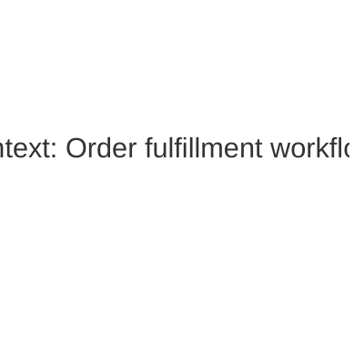

# C4 Diagram Sequence Examples

## Invocation

```txt
/c4-diagram-sequence
Use the architecture plan in this thread and write the C4 diagram doc.
```

## Invocation With File Target

```txt
/c4-diagram-sequence
Read the architecture plan and current decision thread. Write docs/architecture/system-c4.md.
```

## Expected Behavior

The skill should recover the plan and context, ask for missing material only if necessary, normalize the architecture model, choose a useful diagram set, and output a full Markdown document with fenced Mermaid diagrams.

## Example Output Shape

````markdown
# Order fulfillment workflow - C4 diagrams

Scope:
- Customer order placement through fulfillment handoff.

Key decisions:
- The web app owns customer-facing checkout.
- The order API owns validation and order state transitions.
- The fulfillment worker owns asynchronous warehouse handoff.
- The order database is the source of truth for order status.

How to read these diagrams:
| Level | Diagram type | Question it answers |
| --- | --- | --- |
| 1 | System Context | Who uses the system and what external systems does it talk to? |
| 2 | Container | What are the major deployable/runtime pieces? |
| 3 | Component | What important modules live inside changed containers? |
| - | Dynamic | What happens step-by-step during the workflow? |
| - | Deployment | Where does each container run? |

## Level 1 - System Context



## Level 2 - Container

...
````

## Good Diagram Set For An Async Workflow

- Context diagram
- Container diagram
- Component diagrams for the API and worker if their internal responsibilities matter
- Dynamic happy path
- Dynamic failure/retry path if failure behavior is architecturally important
- Deployment diagram
- State diagram for the workflow lifecycle
- Data-flow summary if source-of-truth ownership is easy to confuse
- Evolution table when previous designs were rejected

